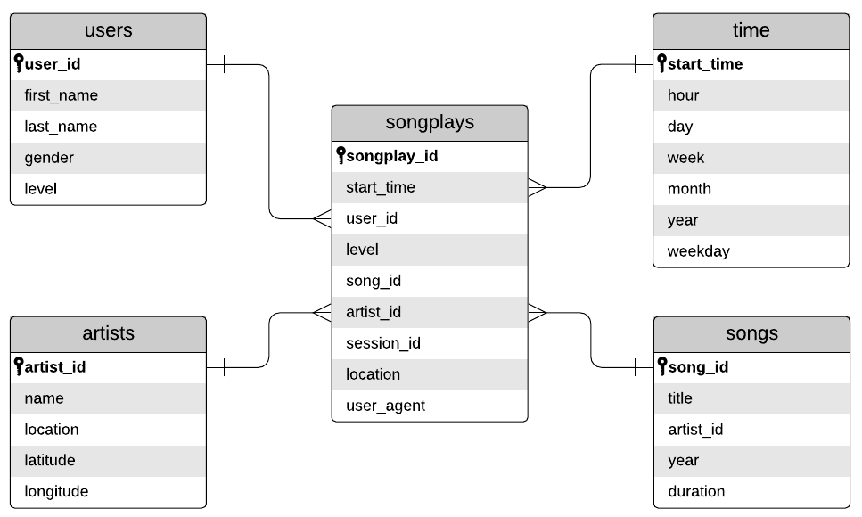

# Sparkify - Data Modeling and Pipelining

## Context

Sparkigy is a startup that recently made a new music streaming app. Their data resides in a directory of JSON logs on user activity on the app, as well as a directory with JSON metadata on the songs in their app. The analytics team is interested in what songs users are listening to.

The purpose of this project is to model a Postgres database design to optimize queries on song play analysis, and then create a database schema and ETL pipeline for this analysis. Finally, the database model is tested by running queries given by the analytics team.

## Database Schema

The schema that has been seen to meet this project requirements is the Star Schema. It includes one fact table containing all measures that is called song plays. Along with other four dimension tables: time, users, songs, and artists. Each primary key in dimension tables is referenced from foreign key in the fact table. A representation of how this Star Schema is structured is in the following image:



Why does Relational Database meets product requirement:

- Easier to change requirements.
  - Sparkify is a growing startup. And it is most likely to change its requirement.

- Aggregation methods are very useful for Analytics team.

- Queries are more felxible and powerful with joins

- No need for big data solutions as data amount is limited.

Why does Star Schema meets product requirement:

- Denormalized form improves query performance which is the main purpose of building the database.

- Improves readability and easy to follow.

### Tables structure detailed

#### Fact Table

**songplays** - records in log data associated with song plays i.e. records with page NextSong

- songplay_id (serial) PRIMARY KEY: a unique ID givin to each songplay event
- start_time (timestamp) REFERENCES from time table: timestamp define the start of a certain user activity
- user_id (int) REFERENCES from users table: ID of the user concerned to this certain activity
- level (varchar): the tupe of the user, eather free or paid
- song_id (varchar) REFERENCES from songs table: ID of the played song
- artist_id (varchar) REFERENCES from artists table: ID of the artist of the played song
- session_id (int): ID of the user session
- location (varchar): location of the user
- user_agent (varchar): The agent used by the user to access Sparkify platform i.e. Chrome, Firefox

##### Dimension Tables

**time** - timestamps of records in songplays broken down into specific units

- start_time (TIMESTAMP) PRIMARY KEY: time stamp of the record, acts like an ID
- hour (int): hour identified by the timestamp
- day (int): day identified by the timestamp
- week (int): week identified by the timestamp
- month (int): month identified by the timestamp
- year (int): year identified by the timestamp
- weekday (varchar): weekday identified by the timestamp

**users** - users in the app

- user_id (int) PRIMARY KEY: user ID
- first_name (varchar) NOT NULL: user first name
- last_name (varchar) NOT NULL: user last name
- gender (varchar): user gender, Male or Female
- level (varchar): the type of the user, eather free or paid

**songs** - songs in music database

- song_id (varchar) PRIMARY KEY: song ID
- title (varchar) NOT NULL: song tilte
- artist_id (varchar) REFERENCES from artists table: song artist ID
- year (int): year when song is released
- duration (numeric) NOT NULL: duration of the song in milliseconds

**artists** - artists in music database

- artist_id (varchar) PRIMARY KEY: artist ID
- name (varchar) NOT NULL: name of the artist
- location (varchar): the city where the artists lives
- latitude (numeric): latitude of artist's location
- longitude (numeric): longitude of artist's location

## Data Files

### Song Dataset

The first dataset is a subset of real data from the Million Song Dataset. Each file is in JSON format and contains metadata about a song and the artist of that song. The files are partitioned by the first three letters of each song's track ID. For example, here are filepaths to two files in this dataset.

```bash
song_data/A/B/C/TRABCEI128F424C983.json song_data/A/A/B/TRAABJL12903CDCF1A.json
```

And below is an example of what a single song file, TRAABJL12903CDCF1A.json, looks like.

```json
{"num_songs": 1,
"artist_id": "ARJIE2Y1187B994AB7",
"artist_latitude": null,
"artist_longitude": null,
"artist_location": "",
"artist_name": "Line Renaud",
"song_id": "SOUPIRU12A6D4FA1E1",
"title": "Der Kleine Dompfaff",
"duration": 152.92036,
"year": 0}
```

#### Log Dataset

The second dataset consists of log files in JSON format generated by this event simulator based on the songs in the dataset above. These simulate activity logs from a music streaming app based on specified configurations.

The log files in the dataset are partitioned by year and month. For example, here are filepaths to two files in this dataset.

```bash
log_data/2018/11/2018-11-12-events.json
log_data/2018/11/2018-11-13-events.json
```

And below is an example of what the data in a log file, 2018-11-12-events.json, looks like.


## Project Structure

1- test.ipynb displays the first few rows of each table to let you check your database.

2- create_tables.py drops and creates your tables. You run this file to reset your tables before each time you run your ETL scripts.

3- etl.ipynb reads and processes a single file from song_data and log_data and loads the data into your tables. This notebook contains detailed instructions on the ETL process for each of the tables.

4- etl.py reads and processes files from song_data and log_data and loads them into your tables. You can fill this out based on your work in the ETL notebook.

5- sql_queries.py contains all your sql queries, and is imported into the last three files above.

6- README.md provides discussion on your project.

7- data folder containing all json files piplined to modeled database.

## ETL Pipeline - etl.py

1- Connection is initiated with the database

2- Connection, cursor, song data path, and function (process_song_file) is passed to process data function

3- process_data in turn gets all files matching extension from passed directory. Then iterate over files and pass each file to process_song_file function

4- process_song_file function converts the json file into a pandas dataframe. Then extracts two lists, one for songs table and the other for artists table. Finaly isnerts the two rows into the database.

5- after pipelining song data, the program passes connection, cursor, log data path, and  function (process_log_file) to process data function

6- process_data again gets all files matching extension from passed directory. Then iterate over files and pass each file to process_log_file function

7- process_log_file function converts the json file into a pandas dataframe. Then filters the dataframe by NextSong action.

8- then process_log_file converts timestamp column to pandas datetime object. Then using the datetime object a time dataframe is created by broken down information givin by the datetim object. Finally the function loops through the log file through and insert into time table

9- a new datafram is created for user data by extracting information by the dataframe created in step 7. Then the function loops through user data frame and insert each row in the users table

10- Finally, the function loops through the dataframe created in step 7. Then gets song ID and artist ID for a certain row from song and artist tables. Afterwards, the function inserts artist ID, song ID, and other required row data to the songplays table

## Steps to run the project

Note: Make sure to connect the files to your database

1- run in terminal create_tables.py to generate the database

```bash
python3 create_tables.py
```

2- run test.ipynb to verify creating the tables
3- run in terminal etl.py to generate the database

```bash
python3 etl.py
```

4- repeat step 2 to check if files pipelined correctly

### Hope You Enjoy the Project
